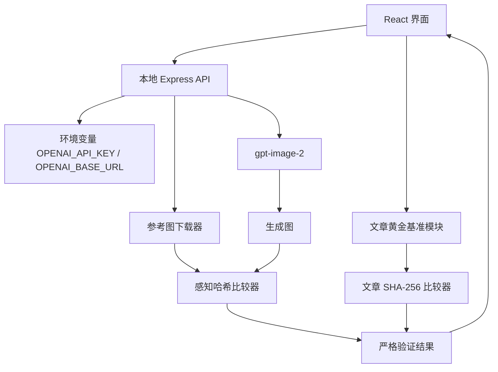

## 1. 架构设计

采用 React 前端和本地 Express 后端。前端生成文章并请求图片；后端只从环境变量读取图片服务配置、调用图像接口、下载参考图与生成图、执行感知哈希计算。



## 2. 技术说明

- 前端：React 18 + TypeScript + Vite。
- 后端：Express + TypeScript，使用 `sharp` 读取、缩放与计算 dHash；使用 Node `crypto` 计算 SHA-256。
- 图像接口：OpenAI 兼容 Images API，模型固定为 `gpt-image-2`。
- 环境变量：`OPENAI_API_KEY`、`OPENAI_BASE_URL`。环境变量只由后端读取，不发送给浏览器、不写入项目文件。
- 黄金文章：已采集的参考文章 HTML 作为基准；基准想法直接返回该文件内容。
- 黄金图片：三张原始公众号图片 URL 下载到本地缓存，作为感知哈希比对目标。

## 3. 严格验证算法

### 3.1 文章

1. 对生成文章与黄金文章统一换行符、清除首尾空白。
2. 使用 SHA-256 计算两者摘要。
3. 同时检查两个规范化字符串的长度与内容严格相等。
4. 只有内容相等时，文章检查通过。

### 3.2 图片

1. 调用 `POST /v1/images/generations`，请求 `gpt-image-2` 生成 3 张图。
2. 下载/解析生成图与参考图。
3. 使用 `sharp` 将每张图灰度缩放至 9×8。
4. 比较相邻像素亮度产生 64 位 dHash。
5. 计算汉明距离。阈值初始设为 18/64；每张图距离小于等于阈值才通过。
6. API 未配置、任意请求失败、图像格式无法读取，均作为失败而非跳过。

## 4. API 定义

### `POST /api/generate-images`

请求：

```ts
{ prompts: string[] }
```

响应：

```ts
{
  images: Array<{
    dataUrl: string
    referenceUrl: string
    hashDistance: number
    threshold: number
    passed: boolean
  }>
  error?: string
}
```

## 5. 数据与文件

| 路径 | 用途 |
|---|---|
| `reference/article.html` | 黄金参考文章。 |
| `reference/images/` | 首次校验时下载并缓存的三张参考图。 |
| `api/server.ts` | 图像生成与感知相似度服务。 |
| `src/lib/strictValidation.ts` | 前端文章严格比较。 |

## 6. 验收契约

界面只有在以下所有条件成立时才显示“严格验证通过”：

- 基准想法生成的文章规范化字符串与黄金文章严格相同，且 SHA-256 相同。
- 图片接口返回 3 张有效图片。
- 三张图片的 dHash 汉明距离均不大于 18。

否则展示具体失败原因。图片成功项只能标记为“相似度通过”，不可标记为完全一致。
