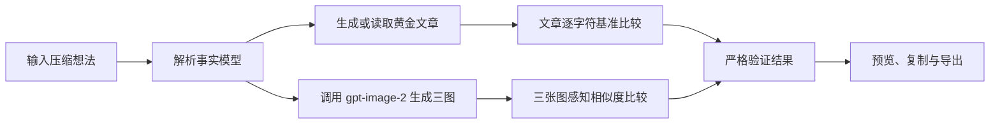

## 1. 产品概述

构建一个本地网页工具，把一句经过压缩的业务想法展开为与参考文章同一组件树、叙事节奏和公众号视觉语言的文章 HTML，并提供严格回归验证。

目标用户是需要发布 AI 产品推广型公众号文章的运营者。工具解决“从一个想法稳定产出可直接粘贴到公众号编辑器的图文文章”的问题。

## 2. 核心功能

### 2.1 页面与模块

1. **生成页**：录入最小想法，生成文章与图片。
2. **文章预览区**：以公众号阅读宽度展示生成 HTML，支持复制。
3. **严格验证区**：显示文章逐字符基准校验，以及三张生成图的感知相似度校验。

### 2.2 功能细节

| 页面 | 模块 | 功能说明 |
|---|---|---|
| 生成页 | 想法输入 | 输入一段产品推广想法；首版内置 Grok 4.5 的反推用例作为默认值。 |
| 生成页 | 文章生成 | 对基准想法直接输出已采集的参考文章 HTML；其他想法按固定组件树生成公众号兼容 HTML。 |
| 生成页 | 图像生成 | 通过本地后端从环境变量读取接口配置，调用 `gpt-image-2` 生成三张证据图。 |
| 生成页 | 文章严格校验 | 对基准想法，生成文章规范化后与黄金参考文章规范化后逐字符比较；不一致即失败。 |
| 生成页 | 图片相似校验 | 将每张生成图与对应参考图缩放至统一尺寸，计算感知哈希距离；距离低于设定阈值才通过。 |
| 生成页 | 预览与复制 | 预览文章、查看生成图片、复制 HTML。 |

## 3. 核心流程

## 4. 用户界面设计

### 4.1 设计风格

- 方向：高密度编辑器 + 公众号成品预览。
- 主色：`#059669`；辅助色：`#10B981`；深色收尾：`#111827`。
- 字体：中文使用霞鹜文楷或思源宋体，信息与代码使用 IBM Plex Mono。
- 布局：桌面优先，左侧编辑与验证，右侧 677px 成品预览。
- 组件：圆角卡片、浅绿描边、细网格背景、克制阴影。

## 5. 严格验收标准

默认的 Grok 4.5 反推用例必须同时通过：

- **文章**：规范化后的生成 HTML 与规范化后的参考文章 HTML 完全相等；显示两个 SHA-256 与“逐字符一致”。
- **图片**：必须实际生成 3 张图；每张图都与对应参考图做感知哈希比较，分别显示距离、阈值和通过状态。
- **失败原则**：缺少本地环境变量、API 请求失败、图片无法下载、任一图片相似度未达阈值、文章不一致，均不得显示“严格验证通过”。
- **诚实标记**：图片状态只允许显示“相似度通过”，禁止显示“图片一模一样”。
